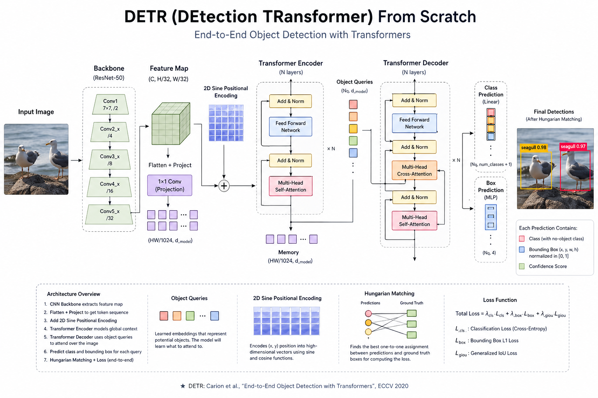

# DETR: Minimal Architecture Implementation



A clean, from-scratch implementation of the DETR (DEtection TRansformer) architecture in PyTorch. 

## Project Structure

- `models/`: High-level DETR model integration.
  - `backbone/`: ResNet50 feature extractor and channel projection.
  - `transformer/`: Custom Multi-Head Attention, Encoder stack, and Decoder stack.
  - `positional_encoding/`: 2D Sine-Cosine positional encodings.
  - `heads/`: Classification and Bounding Box (MLP) prediction heads.
- `utils/`: Helper functions for box operations and coordinate conversions.

## Installation

```bash
pip install torch torchvision
```

## Usage

```python
from models.detr import DETR
import torch

model = DETR(num_classes=20, embed_dim=256, num_layers=6)
image = torch.randn(1, 3, 224, 224)

output = model(image)
print(output["pred_logits"].shape) 
print(output["pred_boxes"].shape)  
```

## Running the Architecture Test

```bash
python3 -m models.detr
```

## Acknowledgments

Based on the paper: [End-to-End Object Detection with Transformers](https://arxiv.org/abs/2005.12872) by Carion et al.
